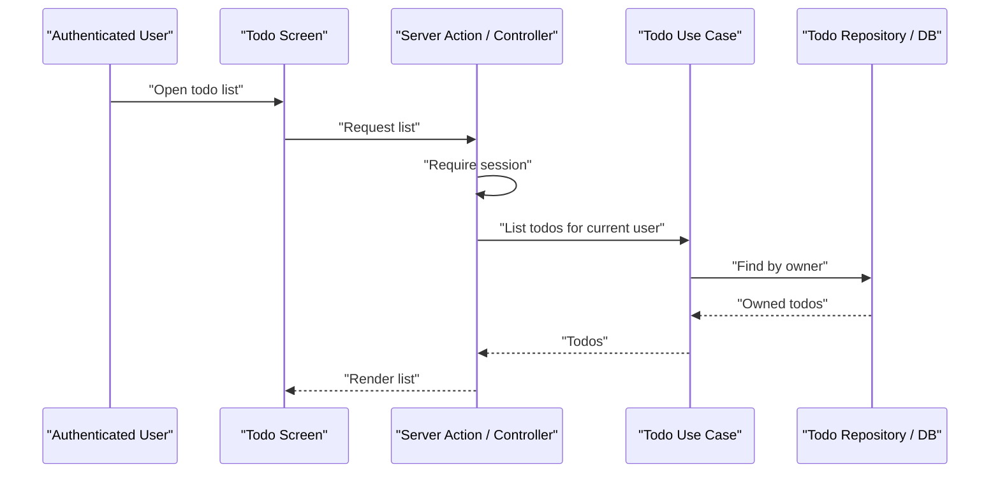

# Authenticated Todo List Plan

<!-- draft: unresolved-blockers 2026-05-27 -->

## 1. Requirements

### 1.1 Overview

Create an authenticated Todo List feature. The requested user story is:

- "スラッシュコマンドをテストします。認証付きTODOリストを作成"

This plan is intentionally a lightweight planning artifact only. It does not start implementation because the current repository is `agent-flow-kit`, a workflow distribution kit, not an application runtime that contains routes, auth, database schema, or UI code.

### 1.2 Current State Analysis

Local context loaded:

- `templates/.claude/rules/*.md`
- `templates/.claude/docs/DESIGN.md`
- `templates/.claude/commands/flow-plan.md`

Repository findings:

- `README.md` and `manifest.json` describe Agent Flow Kit installation, hooks, skills, CI gates, and onboarding flow.
- No application source directories were found at shallow project level: no `src/`, `app/`, `routes/`, `prisma/`, `database/`, or `resources/`.
- Existing templates are workflow artifacts, not a TODO application.
- The local generated `.claude/docs/DESIGN.md` template is intentionally blank and asks the target project to confirm runtime entrypoints.
- The flow-plan reference points to external architecture/style documents. Those documents describe a SvelteKit + DDD stack with Better Auth, Prisma, PostgreSQL, Vitest, Playwright, Bun, and strict TypeScript. That stack is suitable only if the target application is confirmed to match it.
- Local rules currently include Laravel-oriented development commands in `templates/.claude/rules/dev-environment.md`, so the target runtime must be confirmed before implementation.

### 1.3 Requirements List

#### Acceptance Criteria

- [ ] Authenticated users can view only their own TODO items.
- [ ] Unauthenticated users are redirected to sign in or receive an authorization error before accessing TODO data.
- [ ] Authenticated users can create a TODO with non-empty title text.
- [ ] Authenticated users can mark their own TODO as complete or incomplete.
- [ ] Authenticated users can edit the title of their own TODO.
- [ ] Authenticated users can delete their own TODO.
- [ ] A user cannot read, update, complete, or delete another user's TODO item.
- [ ] Input validation rejects empty titles and titles beyond the agreed length limit.
- [ ] The visible UI shows loading, empty, validation error, and normal list states.
- [ ] Feature/integration/browser coverage proves auth isolation and the primary TODO workflow.

### 1.4 Scope

**In scope:**

- Auth-protected TODO list screen.
- User-owned TODO persistence.
- Create, list, update title, toggle completion, and delete operations.
- Server-side authorization checks on every TODO operation.
- Validation for title and ownership.
- Feature-level tests for auth and persistence behavior.
- Browser or Playwright integration coverage for the visible multi-step workflow.

**Out of scope:**

- Team/shared TODO lists.
- Labels, priorities, due dates, reminders, search, sorting, or drag-and-drop.
- Email notifications.
- Offline support or realtime collaboration.
- New auth provider selection unless the target app lacks authentication.
- Implementation inside `agent-flow-kit` itself unless this is explicitly meant to be an example app bundled with the kit.

### 1.5 Blocking Questions Before Implementation

Implementation must not start until these are answered:

1. Is the target implementation repository this `agent-flow-kit` repo, or a separate application repo?
2. What runtime stack should be used: existing target app conventions, SvelteKit + Better Auth + Prisma, Laravel, or another stack?
3. If the target app already has auth, which session/user identity API should TODO ownership use?
4. Should this be a real product feature or a demo/example app for slash-command testing?
5. What is the accepted title length limit and should completed TODOs remain visible by default?

## 2. Design

### 2.1 Architecture Overview

Minimal implementation direction once the target app is confirmed:

1. Reuse the target application's existing authentication/session mechanism.
2. Add a `todo` domain or equivalent existing module nearest to the app's conventions.
3. Persist TODO records with a required `userId` / owner foreign key.
4. Keep ownership checks in server-side use cases or controller/actions, not only in the client UI.
5. Keep UI simple: one authenticated list screen with inline create, edit, toggle, and delete actions.

If the target app is confirmed as SvelteKit + DDD + Prisma:

- Domain: `src/lib/server/todo/domain/`
- Application use cases: `list-todos`, `create-todo`, `update-todo-title`, `toggle-todo-completion`, `delete-todo`
- Infrastructure: Prisma repository implementing a domain repository interface
- Presentation: `src/routes/todos/+page.server.ts` and `src/routes/todos/+page.svelte`
- Auth: session from `locals` / Better Auth integration

If the target app is Laravel:

- Model/table: `todos` with `user_id`
- Controller or action classes under existing app conventions
- Auth middleware on routes
- Policies or explicit ownership checks
- Feature tests using authenticated users and database assertions

### 2.2 Schema Changes

Required if the target app has a database-backed TODO feature:

| Field | Type | Notes |
| --- | --- | --- |
| `id` | UUID/string/integer per existing convention | Primary key |
| `user_id` / `userId` | Existing user key type | Required owner reference |
| `title` | string | Required, trimmed, max length to confirm |
| `completed` | boolean | Defaults to false |
| `created_at` / `createdAt` | timestamp | Existing convention |
| `updated_at` / `updatedAt` | timestamp | Existing convention |

Indexes:

- Owner lookup index on `user_id` / `userId`.
- Optional compound index on owner plus completion state if the existing UI filters completed items.

### 2.3 API Endpoints

Endpoint shape depends on the target app.

SvelteKit-style minimal surface:

| Entry point | Method/action | Responsibility |
| --- | --- | --- |
| `src/routes/todos/+page.server.ts` | `load` | Require auth and list current user's TODOs |
| `src/routes/todos/+page.server.ts` | `create` action | Create TODO for current user |
| `src/routes/todos/+page.server.ts` | `updateTitle` action | Rename current user's TODO |
| `src/routes/todos/+page.server.ts` | `toggleCompletion` action | Toggle current user's TODO |
| `src/routes/todos/+page.server.ts` | `delete` action | Delete current user's TODO |

Laravel-style minimal surface:

| Entry point | Method/action | Responsibility |
| --- | --- | --- |
| `GET /todos` | index | Require auth and list current user's TODOs |
| `POST /todos` | store | Create TODO for current user |
| `PATCH /todos/{todo}` | update | Rename or toggle current user's TODO |
| `DELETE /todos/{todo}` | destroy | Delete current user's TODO |

### 2.4 Data Flow

### 2.5 Design Decisions

| Decision | Rationale | Alternatives Considered |
|----------|-----------|------------------------|
| Reuse existing auth and route conventions | Minimizes scope and avoids introducing a second auth path | New standalone auth system |
| Store owner key on every TODO | Enforces user isolation in persistence and tests | Client-side filtering only |
| Use server-side actions/controllers for mutations | Keeps authorization and validation server-side | Client-only state management |
| Keep CRUD fields minimal | Matches the request and avoids feature creep | Labels, due dates, priorities |
| Keep plan draft until target runtime is confirmed | Current repo lacks app runtime and has mixed Laravel/SvelteKit references | Guess a stack and freeze prematurely |

### 2.6 Business Flow Matrix

| Flow | Entry point | Existing behavior | New behavior | Regression risk | Test coverage |
| --- | --- | --- | --- | --- | --- |
| Authenticated TODO listing | `/todos` or target equivalent | No TODO app exists in this repo | Authenticated user sees only own TODOs | Data leakage across users | Feature + browser |
| Unauthenticated access | `/todos` or target equivalent | No TODO app exists in this repo | Anonymous user is redirected or rejected | Private data exposed | Feature + browser |
| TODO creation | Form action/API | No TODO app exists in this repo | Valid title creates TODO owned by current user | Missing owner, invalid input stored | Feature |
| TODO update/toggle/delete | Form action/API | No TODO app exists in this repo | Only owner can mutate TODO | Cross-user mutation | Feature |
| Visible list workflow | TODO screen | No TODO app exists in this repo | Empty, create, edit, complete, delete states render correctly | UI state drift or broken forms | Playwright integration |

### 2.7 Regression Surface Matrix

| Surface | Affected? | Evidence | Required verification |
| --- | --- | --- | --- |
| Routes/controllers | Yes | TODO route/controller/action will be added in target app | Feature tests for auth and CRUD |
| Screens/Blade/JS | Yes | Visible TODO screen is required | Browser/Playwright check |
| API/Ajax flows | Maybe | Depends on form actions vs API endpoints | Feature/browser check if API exists |
| Shared partials/scripts/services/actions | Maybe | Depends on target app conventions | Regression test if shared helpers are touched |
| Schema/migrations | Yes | TODO persistence requires schema | Migration/runtime validation |
| Jobs/schedules | No | No async workflow requested | N/A |
| Mail/PDF/export | No | No notification/export requested | N/A |
| Auth/permissions | Yes | Feature is explicitly authenticated | Feature/browser tests for anonymous, owner, non-owner |

### 2.8 Test Design Matrix

| Test ID | Level | Target | Scenario | Expected result | Covers flow/risk |
| --- | --- | --- | --- | --- | --- |
| TEST-001 | Feature | Auth-protected list route | Anonymous user opens TODO list | Redirect or 401/403 per app convention | Unauthenticated access |
| TEST-002 | Feature | TODO create action/API | Authenticated user creates valid TODO | Record exists with current user's owner key | Creation + ownership |
| TEST-003 | Feature | TODO create validation | Empty title is submitted | Validation error, no record created | Input validation |
| TEST-004 | Feature | TODO list query | User A and User B each have TODOs | User A sees only User A TODOs | Data isolation |
| TEST-005 | Feature | TODO mutation authorization | User B updates/deletes User A TODO | Forbidden or not found; original record unchanged | Cross-user mutation |
| TEST-006 | Browser/Playwright | TODO screen | Sign in, create, toggle, edit, delete TODO | Each visible state updates correctly with screenshots | Visible workflow |
| TEST-007 | Migration/runtime | Database schema | Run migration in target runtime | TODO table/model available | Schema enforcement |

### 2.9 Migration / Runtime Enforcement

- Migration needed: Yes, if this is implemented as a persisted product feature.
- Migration enforcement path: Blocked until target runtime is confirmed.
- Runtime validation command: Blocked until target runtime is confirmed.

Potential commands after runtime confirmation:

- SvelteKit/Prisma: `bunx prisma migrate dev --name add-todos`, `bun test`, `bunx tsc --noEmit`
- Laravel: `php artisan migrate`, `./vendor/bin/phpunit --no-coverage`

### 2.10 Playwright Integration Test Plan

| Scenario ID | Business flow | Entry point | Major steps requiring screenshots | Expected result | Risk covered |
| --- | --- | --- | --- | --- | --- |
| PW-001 | Authenticated TODO workflow | `/todos` or target equivalent | Signed-in empty list, after create, after toggle, after edit, after delete | User can complete core workflow without console/network errors | Visible CRUD regression |
| PW-002 | Auth redirect | `/todos` or target equivalent | Anonymous access attempt, resulting sign-in/error screen | Anonymous user cannot see TODO data | Auth leakage |

Evidence output:

- `docs/flow/authenticated-todo-list/integration-test/{run_id}/index.html`
- `docs/flow/authenticated-todo-list/integration-test/{run_id}/screenshots/`
- `docs/flow/authenticated-todo-list/integration-test/{run_id}/test-review.md`
- `docs/flow/authenticated-todo-list/integration-test/{run_id}/business-flow-impact.md`

## 3. Tasks

### 3.1 Overview

- Total tasks: 9
- TDD tasks: 6
- DIRECT tasks: 3

### 3.2 Task List

#### TASK-001: Confirm target runtime and feature intent

- [ ] **Completed**
- **Type**: DIRECT
- **Requirements**: 1.5
- **Dependencies**: None
- **Details**:
  - Confirm whether implementation belongs in `agent-flow-kit` as an example/demo or in a separate application repo.
  - Confirm runtime stack, auth mechanism, persistence layer, and route conventions.
- **Test Requirements**:
  - [ ] N/A; this is a planning blocker resolution task.

#### TASK-002: Confirm TODO behavior boundaries

- [ ] **Completed**
- **Type**: DIRECT
- **Requirements**: 1.3, 1.4, 1.5
- **Dependencies**: TASK-001
- **Details**:
  - Confirm title length, completed item visibility, and whether edit/delete are required for the initial slice.
- **Test Requirements**:
  - [ ] Acceptance criteria updated after answers.

#### TASK-003: Add Red tests for auth access and ownership

- [ ] **Completed**
- **Type**: TDD
- **Requirements**: Acceptance Criteria 1, 2, 7
- **Dependencies**: TASK-001, TASK-002
- **Details**:
  - Add tests for anonymous access, owner access, and non-owner access.
- **Test Requirements**:
  - [ ] Red test written before implementation.
  - [ ] Relevant regression surface covered or explicitly waived with reason.

#### TASK-004: Add Red tests for create/list/update/delete behavior

- [ ] **Completed**
- **Type**: TDD
- **Requirements**: Acceptance Criteria 3, 4, 5, 6, 8
- **Dependencies**: TASK-001, TASK-002
- **Details**:
  - Add tests for valid create, validation failure, list filtering, title update, completion toggle, and delete.
- **Test Requirements**:
  - [ ] Red test written before implementation.
  - [ ] Relevant regression surface covered or explicitly waived with reason.

#### TASK-005: Add TODO persistence schema

- [ ] **Completed**
- **Type**: TDD
- **Requirements**: Acceptance Criteria 1, 3, 7
- **Dependencies**: TASK-003, TASK-004
- **Details**:
  - Add TODO table/model following target app conventions.
  - Add owner key and owner lookup index.
- **Test Requirements**:
  - [ ] Migration/runtime validation command passes.
  - [ ] Schema-dependent tests run against migrated runtime.

#### TASK-006: Implement TODO domain/use-case/controller or action layer

- [ ] **Completed**
- **Type**: TDD
- **Requirements**: Acceptance Criteria 1-8
- **Dependencies**: TASK-005
- **Details**:
  - Implement server-side ownership and validation checks.
  - Keep business logic out of the client-only UI.
- **Test Requirements**:
  - [ ] TASK-003 and TASK-004 tests pass.

#### TASK-007: Implement authenticated TODO screen

- [ ] **Completed**
- **Type**: TDD
- **Requirements**: Acceptance Criteria 1-10
- **Dependencies**: TASK-006
- **Details**:
  - Add minimal UI for empty state, create, edit, complete, and delete.
  - Reuse existing components/styles where available.
- **Test Requirements**:
  - [ ] Browser-visible behavior covered by Playwright or documented blocker.

#### TASK-008: Add Playwright integration evidence

- [ ] **Completed**
- **Type**: TDD
- **Requirements**: Acceptance Criteria 9, 10
- **Dependencies**: TASK-007
- **Details**:
  - Capture major-step screenshots for authenticated workflow and anonymous access.
  - Generate integration evidence under the planned output directory.
- **Test Requirements**:
  - [ ] `index.html`, screenshots, `test-review.md`, and `business-flow-impact.md` exist.

#### TASK-009: Final verification and report

- [ ] **Completed**
- **Type**: DIRECT
- **Requirements**: All acceptance criteria
- **Dependencies**: TASK-008
- **Details**:
  - Run formatting, type checks, feature tests, migration validation, and browser checks for the target stack.
- **Test Requirements**:
  - [ ] Final report names regression surfaces covered by tests.

## 4. READINESS

### 4.1 Consistency Check

- [x] Every requirement has at least one task.
- [x] Every task maps to at least one requirement.
- [x] Design decisions are consistent with requirements.
- [x] Task dependencies have no cycles.
- [x] Architecture compliance verified against local templates and fetched reference docs.
- [x] Code style compliance verified at planning level.
- [x] Business Flow Matrix covers affected workflows.
- [x] Regression Surface Matrix covers indirect effects.
- [x] Test Design Matrix maps risks to tests before implementation.
- [x] Migration enforcement is documented as blocked pending target runtime confirmation.
- [x] Browser verification plan is documented for visible behavior.
- [x] Playwright Integration Test Plan maps visible/multi-step workflows to screenshot evidence.

### 4.2 Blocking Issues

- BLOCKING: Target implementation repo/runtime is not confirmed. The current repo is an Agent Flow Kit distribution package, not an app runtime.
- BLOCKING: Existing local template rules and fetched architecture references point to different stacks. Implementation must choose the target app's actual conventions before coding.
- BLOCKING: Auth/session API and persistence layer are unknown.

### 4.3 Notes

- This plan is not frozen. Do not run `/flow-impl` until the blocking issues are answered and the plan is updated with a `<!-- frozen: v1 YYYY-MM-DD -->` marker.
- The minimal implementation should reuse the target app's existing auth and persistence patterns rather than adding a new auth subsystem.
